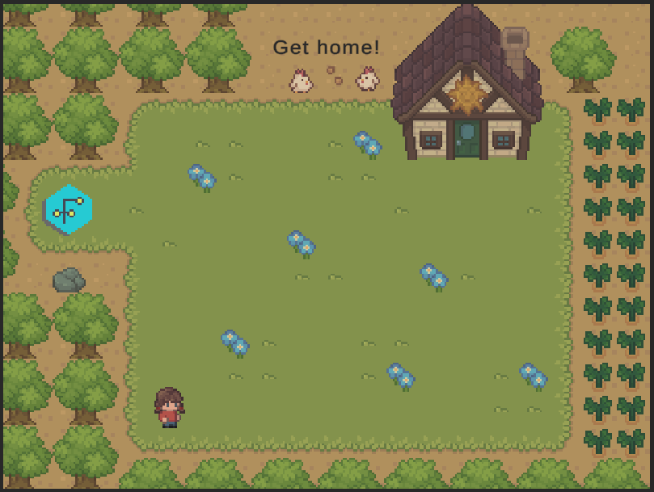
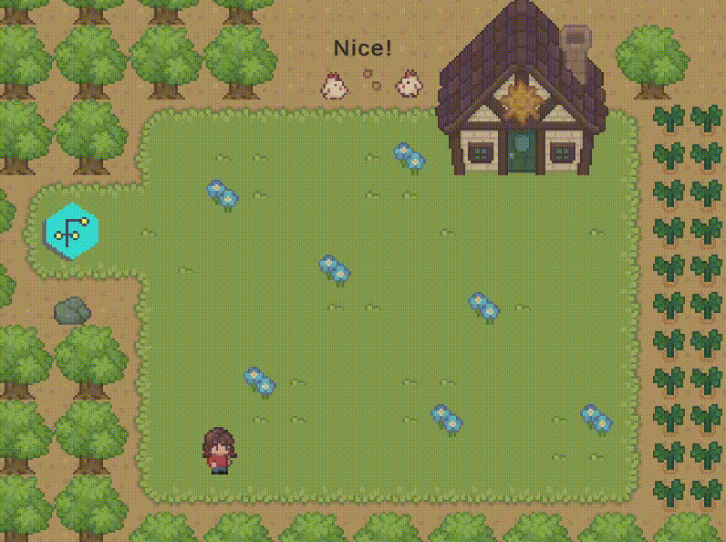

# Factored Workshop 2D
This repository contains all the material presented during the "Reinforcement Learning & Unity" workshop.

# Workshops
- 2023-06-27

# Game Mechanics
The objective of this simple game is to get the agent to the house's door. There is a portal in the map that will teleport the player to a fixed position on the map.

## Observation Space
The state consists of the `(x, y)` coordinates of the player on the map. The starting position is always `(0, 0)`.

## Action Space
The action space consists of 4 discrete actions:
- 0: Move Up
- 1: Move Right
- 2: Move Down
- 3: Move Left

## Rewards
The agent's objective is to get the ball into the goal.
- +2.3 when the agent reaches the house's door.
- -0.1 Existential penalty (each step).

This reward selection means a perfect agent will get a total reward of `1.0` per episode.
 
## Episode Termination
The episode finishes when the agent reaches the house's door, or after 200 steps.

## Starting State
The agent always starts at `(0, 0)`. Everything in this environment is fixed.

## Completion
The environment is considered solved when the average reward is greater than `0.9` over 100 episodes for the optimal solution, or greater than `0.5` for a sub-optimal solution.

# Game Preview

# AI Demo
The following agent was trained using `ml-agents` and a `ppo` approach. It reaches the goal, but not in an optimal way. Are you able to train a better agent?

# Useful links
- [Unity Code](https://github.com/CarloCDT/Factored-Workshop-2D-Unity)
